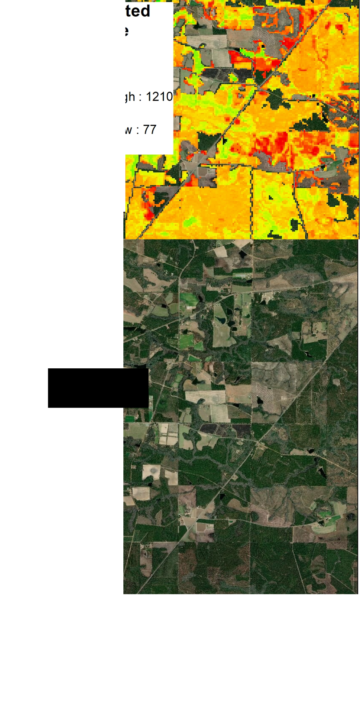

This repository is created to present my code samples of my two projects. All the code is available and can be executed from the Google Earth Engine javaScript API.
https://code.earthengine.google.com/?accept_repo=users/sobata5632/harmonic

The project samples presented are 

1. Estimation of the last disturbance year in Georgia using time series Landsat imagery
2. Estimation of the volume of forest stands in Georgia using machine learning and dense Landsat imagery

# Estimation of the last disturbance year in Georgia using time series Landsat imagery

The objective of this project is to create a forest disturbance record for the years 1984-2016, through the use of all available Landsat TM/ETM data. Two primary disturbance detection methods, a threshold algorithm and a statistical boundary method, were combined to develop a robust estimation of recent forest disturbance history. 

# Estimation of the volume of forest stands in Georgia using machine learning and dense Landsat imagery

The objective of this project is to estimate the growing stock volume of the forest stand with 30-meter spatial resolution in Georgia, United States.

## Harmonic data creation
 `CustomExport` script creates a multi-layer raster data that contains (1) Coefficients of the harmoinic regression on an arbitrary band or index derive from dense time series Landsat 5 and 7 imagery, (2)fitted value of the harmonic regression. 

### Input
The input is time series Landsat imagery.
It is  transformed to tasseled cap components using Crist (1985).

### Output
1. Three-bands ImageCollection comprised of original time series value of the selected band, fitted value of the harmonic regression. squared error of the estimation.  
2. Single band image of which pixel value represents the amplitude of the harmonic regression.
3. Four-bands image comprised of coefficients of the harmonic regression.

## Join the created raster data with the national-scale forest inventory
The output of the Google Earth Engine is combined with Forest Inventory and Analysis database by US Forest Service. As a result I acquired the tabular data that contains the growing stock volume measured in Forest Inventory and Analysis and the band values of the raster created in Google Earth Engine. 

## Random forest regression
The tabular data is used to perform the random forest regression. scikit-learn is used to perform the Random forest regression. The detail will be explained in the manuscript we are preparing to submit a scientific journal.

## Create a volume estimation map
Using the regressor developed by the random forest regression, a volume estimation map is created for each Landsat tile. The data can be used to estimate the volume of single stand volume. 
